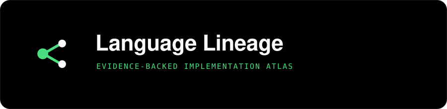
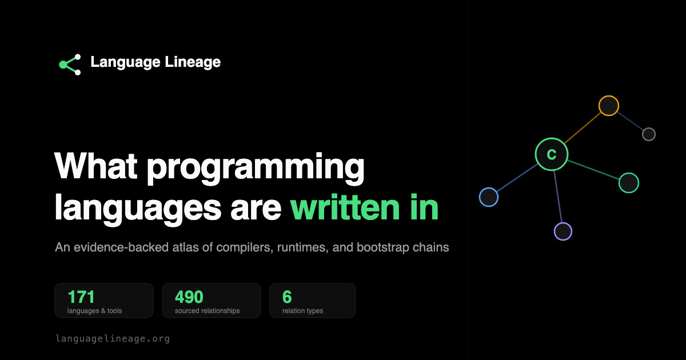

<p align="center">
  
</p>

<p align="center">
  <a href="https://www.languagelineage.org"><strong>languagelineage.org</strong></a>
  &nbsp;&middot;&nbsp;
  <a href="https://www.languagelineage.org/explore">Explore the graph</a>
  &nbsp;&middot;&nbsp;
  <a href="https://www.languagelineage.org/dataset">Dataset</a>
  &nbsp;&middot;&nbsp;
  <a href="https://www.languagelineage.org/guides">Guides</a>
</p>

# Language Lineage

An interactive, evidence-backed atlas mapping implementation, bootstrapping, runtime, and influence relationships across 152 nodes: 131 programming languages and 21 compiler/runtime tools. 306 indexable pages, 443 sourced relationships.

## Live Site

**[languagelineage.org](https://www.languagelineage.org)**

- Interactive graph explorer: [/explore](https://www.languagelineage.org/explore) (deep-linkable via `?node=lang:rust`, trace mode for shortest paths)
- Language pages: [/languages/python](https://www.languagelineage.org/languages/python) (152 pages with relationship maps, Quick Facts, implementation tables)
- Question pages: [/questions/what-is-rust-written-in](https://www.languagelineage.org/questions/what-is-rust-written-in) (120 pages, answer-first format)
- Guides: [/guides](https://www.languagelineage.org/guides) (13 guides including comparisons and bootstrap chain analysis)
- Dataset: [/dataset](https://www.languagelineage.org/dataset) (JSON-LD, download, citation block, embed kit)
- Embeddable graph: `<iframe src="https://www.languagelineage.org/embed?lang=rust">` (works from any page)

<p align="center">
  
</p>

## What You Can Explore

- How C underpins nearly everything: 75 total connections, the most connected node
- The Go 1.5 bootstrap: C compiler to self-hosting Go compiler (2015)
- Rust's path: OCaml to self-hosting Rust via staged bootstrapping, with an LLVM backend
- How Lisp (1958) influenced 15 languages with only 1 incoming edge
- JavaScript engine diversity: V8, SpiderMonkey, JavaScriptCore, all written in C++
- The JVM ecosystem: Java, Kotlin, Scala, Clojure, Groovy sharing a runtime

## Architecture

```
LanguageLineage/
├── src/
│   ├── app/                           App shell, routing, embed
│   │   ├── App.tsx                    Root component, dataset loading, routing
│   │   ├── App.css                    App-level styles
│   │   ├── GraphExplorer.tsx          Explore page shell, deep links (?node=), trace mode
│   │   └── EmbedGraph.tsx             Embeddable graph (/embed?lang=)
│   ├── data/                          Data pipeline
│   │   ├── types.ts                   TypeScript types (languages, edges, filters, Cytoscape elements)
│   │   ├── loadDataset.ts             Fetch dataset JSON by version
│   │   ├── validateDataset.ts         Integrity checks (duplicates, dangling refs, confidence)
│   │   ├── normalizeDataset.ts        Compute degrees, assign clusters, build lookup maps
│   │   ├── indexDataset.ts            Build search index for fast lookups
│   │   ├── logoMap.ts                 Logo URL resolution map
│   │   └── graphLogoAssets.ts         Logo rendering for graph nodes
│   ├── graph/                         Cytoscape.js rendering
│   │   ├── GraphView.tsx              Cytoscape container and lifecycle management
│   │   ├── buildElements.ts           Filter to Cytoscape element conversion
│   │   ├── style.ts                   Node/edge styles, cluster colors, relationship colors
│   │   ├── layouts.ts                 DAG (tree) and force-directed layout configs
│   │   ├── cytoscapeConfig.ts         Cytoscape core settings
│   │   └── selectors.ts              Cytoscape selector helpers, focus/trace mode
│   ├── store/                         State management
│   │   └── useGraphStore.ts           Zustand store (dataset, filters, selection, Cytoscape ref)
│   ├── ui/                            UI components
│   │   ├── LandingPage.tsx            Homepage with hero, atlas glimpse, field records
│   │   ├── LandingPage.css            Landing page styles
│   │   ├── LandingGraphGlimpse.tsx    Live graph preview on homepage
│   │   ├── HeroFx.tsx                 Hero section visual effects
│   │   ├── MinimalPanel.tsx           Floating control panel (layout, search, filters)
│   │   ├── MinimalPanel.css           Control panel styles
│   │   ├── SideDrawer.tsx             Node/edge detail drawer with relationship table
│   │   ├── SideDrawer.css             Side drawer styles
│   │   ├── NavigationControls.tsx     Graph navigation (zoom, fit, reset)
│   │   ├── TimelineControls.tsx       Timeline scrubber for filtering by year
│   │   ├── YearsPanel.tsx             Year range panel
│   │   ├── Legend.tsx                 Color legend
│   │   ├── RelationshipFilters.tsx    Edge type toggles
│   │   ├── SearchBox.tsx              Debounced search input
│   │   ├── EdgeTooltip.tsx            Edge hover tooltip
│   │   ├── Slider.tsx                 Confidence threshold slider
│   │   └── Toggle.tsx                 Boolean toggle component
│   ├── fx/                            Visual effects
│   │   ├── constellation.ts           Background star field
│   │   ├── cursorGlow.ts              Cursor glow effect
│   │   ├── dataFlow.ts                Data flow animation
│   │   ├── decode.ts                  Text decode animation
│   │   └── interactions.ts            Interaction effects
│   ├── pages/                         SPA page components
│   │   └── NotFound.tsx               404 page
│   ├── seo/                           SEO utilities
│   │   └── Seo.tsx                    React Helmet wrapper
│   ├── styles/                        Design tokens
│   │   └── tokens.css                 CSS custom properties (SPA)
│   └── utils/                         Shared utilities
├── dataset/
│   ├── v1/                            28 languages, initial dataset
│   ├── v2/                            67 languages, 128 edges
│   ├── v3/                            71 languages, 169 edges
│   ├── v4/                            112 nodes, 347 relationships
│   └── v5/                            152 nodes, 443 relationships (current)
│       ├── lineage_v5.json            Primary dataset
│       └── enrichment_v5.json         Wikidata-sourced facts (148/152 nodes)
├── scripts/                           Build and data tooling
│   ├── generateSeoPages.ts            Static page generator (152 node pages, 120 question pages, 13 guides, 6 relationship pages, etc.)
│   ├── generateSitemap.ts             Sitemap generator (306 URLs)
│   ├── generateLlmsTxt.ts             LLM-readable site index
│   ├── generateOgImages.ts            Per-page OG social cards (satori + resvg)
│   ├── generateV5Dataset.ts           v4 to v5 dataset migration
│   ├── validateSeo.ts                 SEO validation suite (0 errors expected)
│   ├── auditInternalLinks.ts          Internal link graph audit
│   ├── analyzeGsc.ts                  GSC measurement loop analysis (Phase 14)
│   ├── analyzeDataset.ts              Dataset integrity and graph metrics
│   ├── harvestWikipediaContent.ts     Wikidata enrichment harvester
│   ├── harvestWikimediaLogos.ts       Logo candidate harvester
│   ├── renderGraphLogoAssets.ts       Graph logo asset pipeline
│   ├── applyLogoOverrides.ts          Logo override application
│   ├── schema.ts                      Zod validation schemas
│   ├── addNewFields.ts                Field migration helper
│   ├── enrichData.ts                  Metadata population helper
│   ├── fixMalformedEntries.ts         Entry normalization helper
│   └── assets/                        Font files for OG image generation
├── public/
│   ├── fonts/                         Self-hosted web fonts (Fraunces, Geist, JetBrains Mono)
│   ├── og/                            Per-page OG social images (191 PNGs)
│   ├── seo.css                        Static page styles (design tokens mirrored from tokens.css)
│   ├── og-image.png                   Default OG image
│   ├── favicon.svg                    Directed-triad favicon
│   └── (generated pages)             Static HTML output from seo:generate
├── tests/                             Playwright test specs
├── .github/workflows/deploy.yml       GitHub Pages deployment (Node 22)
├── vercel.json                        Vercel redirects and headers
├── index.html                         SPA entry point
├── vite.config.ts                     Vite configuration
├── tsconfig.json                      TypeScript config
└── SITE_IMPROVEMENT_PLAN.md           Master improvement plan (14 phases)
```

## Tech Stack

| Layer | Technology | Purpose |
|-------|-----------|---------|
| Build | Vite 5 | Dev server, production bundling, HMR |
| UI | React 18 | Component rendering |
| Language | TypeScript 5 | Strict type safety across data pipeline |
| Graph | Cytoscape.js 3.28 | Graph rendering, layouts, interaction |
| Layout | cose-bilkent 4.1 | Force-directed layout algorithm |
| State | Zustand 4 | Lightweight store for filters, selection, Cytoscape ref |
| Routing | react-router-dom 7 | SPA routing and deep links |
| SEO | react-helmet-async | Dynamic meta tags for SPA routes |
| Validation | Zod 3.23 | Runtime schema validation for dataset tooling |
| OG Images | satori + resvg | Build-time social card generation |
| Testing | Playwright | End-to-end browser testing |
| Hosting | Vercel | Production deploy from `main` branch |

## Dataset (v5)

### Scale

- 152 nodes: 131 languages + 21 tools (compilers, runtimes, engines)
- 443 relationships, each with confidence score and evidence source URL
- 100% evidence coverage: every relationship has at least one source
- 96 logo URLs: 51 Devicon assets + 39 Wikimedia P154 logos + 6 proxy logos
- 148/152 nodes enriched with Wikidata-sourced facts (designers, developers, license, website, file extensions)

### Relationship Types

| Type | Count | Color | Description |
|------|-------|-------|-------------|
| `influenced` | 252 | Amber | Language A influenced the design of language B |
| `compiler_written_in` | 96 | Amber | Language A's compiler is written in language B |
| `runtime_written_in` | 67 | Green (#34d399) | Language A's runtime is written in language B |
| `bootstrap_written_in` | 15 | Violet | Bootstrap binary seed relationship |
| `transpiled_to` | 11 | Cyan (#22d3ee) | Language A compiles to language B |
| `rewritten_in` | 2 | Rose | Implementation rewritten from one language to another |

Each relationship includes: `from_language`, `to_language`, `start_year`, `end_year`, `confidence` (0.0-1.0), `evidence_source` (URL), and `notes`.

### Graph Metrics

From the dataset analyzer (`npm run analyze:v5`):

- Most connected: C (75), C++ (36), Haskell (29), Python (29), Rust (26)
- Connected components: 1 (fully connected graph)
- Self-loops: 28 (self-hosting languages)
- Isolated nodes: 0

## Route Structure

| Route | Type | Count | Description |
|-------|------|-------|-------------|
| `/` | SPA | 1 | Landing page with graph preview and field records |
| `/explore` | SPA | 1 | Interactive graph explorer (supports `?node=` deep links) |
| `/embed` | SPA | 1 | Embeddable graph (accepts `?lang=` query param) |
| `/languages` | Static | 1 | Index of all 131 languages |
| `/languages/{slug}` | Static | 131 | Individual language pages |
| `/tools` | Static | 1 | Index of all 21 tools |
| `/tools/{slug}` | Static | 21 | Individual tool pages |
| `/questions` | Static | 1 | Index of all question pages |
| `/questions/{slug}` | Static | 120 | "What is X written in?" answer pages |
| `/guides` | Static | 1 | Index of all guides |
| `/guides/{slug}` | Static | 13 | Implementation guides and comparisons |
| `/relationships` | Static | 1 | Index of all relationship types |
| `/relationships/{slug}` | Static | 6 | Individual relationship type pages |
| `/timeline` | Static | 1 | Language timeline page |
| `/dataset` | Static | 1 | Dataset overview with download, citation, and embed kit |
| Keyword landings | Static | 6 | Root-level SEO landing pages |
| `/sitemap.xml` | XML | 1 | 306 indexable URLs |
| `/robots.txt` | Text | 1 | Crawler directives |
| `/llms.txt` | Text | 1 | LLM-readable site index |
| `/llms-full.txt` | Text | 1 | Expanded LLM reference |

## Quick Start

```bash
git clone https://github.com/sanketmuchhala/LanguageLineage.git
cd LanguageLineage

npm install

# Development server
npm run dev

# Production build (generates static pages, then compiles)
npm run build

# Generate static HTML pages, sitemap, and llms.txt
npm run seo:generate

# Validate all generated pages (0 errors, 0 warnings expected)
npm run seo:validate

# Type check
npm run type-check

# Run dataset analyzer
npm run analyze:v5
```

## Scripts

| Script | Command | Purpose |
|--------|---------|---------|
| `dev` | `npm run dev` | Start Vite development server |
| `build` | `npm run build` | SEO generate + TypeScript + Vite production build |
| `type-check` | `npm run type-check` | TypeScript type checking (`tsc --noEmit`) |
| `seo:generate` | `npm run seo:generate` | Generate all static HTML pages, sitemap, and llms.txt |
| `seo:validate` | `npm run seo:validate` | Validate all generated pages (0 errors, 0 warnings) |
| `seo:links` | `npm run seo:links` | Audit internal link graph (orphans, depth, broken links) |
| `og:generate` | `npm run og:generate` | Generate per-page OG social card images |
| `gsc:analyze` | `npm run gsc:analyze` | Analyze GSC exports against baseline (Phase 14 measurement loop) |
| `analyze:v5` | `npm run analyze:v5` | Dataset integrity, schema validation, and graph metrics |
| `content:wikipedia` | `npm run content:wikipedia` | Harvest Wikidata facts into enrichment_v5.json |
| `logos:wikimedia` | `npm run logos:wikimedia` | Harvest Wikimedia logo candidates |
| `logos:graph` | `npm run logos:graph` | Render graph logo assets |
| `dataset:v5` | `npm run dataset:v5` | Regenerate v5 dataset from v4 input plus logo metadata |
| `test:embed` | `npm run test:embed` | Playwright test for embed iframe functionality |

## Adding a New Language

1. Edit `dataset/v5/lineage_v5.json`: add the language node and relationships
2. Run `npm run content:wikipedia` to harvest Wikidata enrichment
3. Run `npm run seo:generate` to regenerate all static pages
4. Run `npm run seo:validate` to confirm 0 errors
5. Commit and push (Vercel deploys `main` automatically)

## Controls

### Layout Modes

- **Tree (DAG)**: Hierarchical top-down layout, good for seeing lineage chains
- **Network (Force)**: Organic clustering, shows communities and influence patterns

### Filters

- **Search**: Filter by language name or ID
- **Confidence Threshold**: Slider from 0.00 to 1.00, hides uncertain edges
- **Relationship Types**: Toggle each of the 6 edge types independently
- **Self-Loops**: Show or hide self-hosting edges (e.g., Rust to Rust)
- **Cluster Coloring**: Color nodes by language family
- **Labels**: Show or hide node labels
- **Timeline**: Scrub by year to see the graph evolve over time

### Interaction

- Click a node to open the detail drawer with metadata and connections
- Click an edge to see relationship details, evidence source, and confidence
- Use `?node=lang:rust` in the URL to deep-link to a focused node
- Trace mode: pick two nodes to compute and highlight the shortest path between them
- "As table" view in the drawer for accessible, keyboard-navigable relationship data
- Drag to pan, scroll to zoom

## Dataset Versioning

| Version | Nodes | Edges | Key Changes |
|---------|-------|-------|-------------|
| v1 | 28 | ~50 | Initial dataset, compilers and runtimes only |
| v2 | 67 | 128 | Extended with more languages, implementations array |
| v3 | 71 | 169 | Added influence relationships |
| v4 | 112 | 347 | Full enrichment: 5 new metadata fields, influence edges, 41 data fixes |
| v5 | 152 | 443 | 40 new nodes, sourced logo URLs (96), Wikidata enrichment (148/152), logo metadata |

The app loads v5 by default. Previous versions remain available in `dataset/`.

## Notable Relationships

- **C to Go Bootstrap (2009-2015)**: Go's compiler was written in C, then rewritten in Go for v1.5
- **Rust Bootstrap**: OCaml (rustboot) to self-hosting Rust via staged builds, with an LLVM backend
- **Swift**: C++/Swift hybrid compiler with SwiftCompilerSources
- **TypeScript to JavaScript**: Transpilation relationship (TypeScript compiles to JS via tsc, swc, or esbuild)
- **Lisp's Influence**: 15 outgoing influence edges, 1 incoming
- **C's Dominance**: 75 total connections (65 outgoing), foundation of modern computing

## Citation

```
Language Lineage. Programming Language Lineage Dataset, v5.0.
152 nodes and 443 relationships. Accessed 2026. https://www.languagelineage.org/dataset
```

## Contributing

1. Fork the repository
2. Create a feature branch
3. Make changes with evidence sources
4. Run `npm run analyze:v5` and `npm run seo:validate` to validate
5. Submit a pull request

### Data Contributions

- All new relationships must include `evidence_source` (URL)
- Confidence scores required (1.0 = primary source, 0.8+ preferred)
- Prefer null over guessing for enriched fields
- Run the analyzer before submitting. Schema and integrity must pass.

## License

The dataset is licensed under [Creative Commons Attribution 4.0 International](https://creativecommons.org/licenses/by/4.0/) (CC BY 4.0). Source code is MIT licensed.
